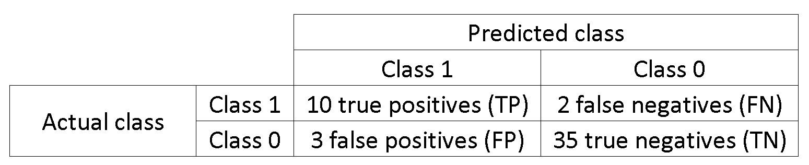
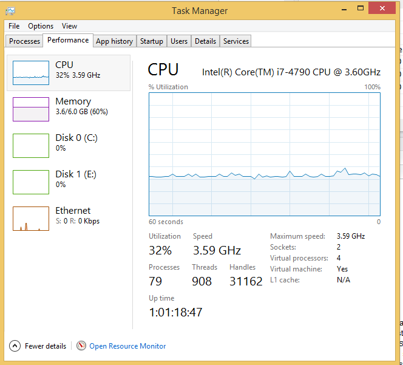
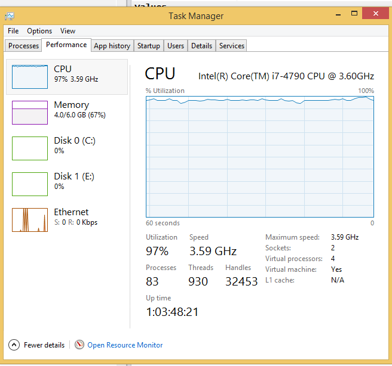

```{r setup, include=FALSE}
knitr::opts_chunk$set(echo = TRUE)
knitr::opts_chunk$set(cache=TRUE)
```


## Caret model tuning

### Carlos Santillan

https://csantill.github.io/RTuningModelParameters/


```{r initialize,message=FALSE, cache=FALSE}
# load the library
#install.packages(c("dplyr","e1071", "caret", "doSNOW", "ipred", "xgboost","rattle","rpart.plot","mlbench"))
library(mlbench)
library(plyr); library(dplyr)
library(caret)
library(rattle)					# Fancy tree plot
library(rpart.plot)	
library(dplyr)
library(parallel)
library(rpart)
reset.seed <- function()
{
  # ensure results are repeatable
  set.seed(1337)
}

```


## caret (Classification And Regression Training)

The caret package contains set of functions to streamline model training for Regression and Classification.

  * Standard Interface for Modeling and Prediction
  * Simplify Model tuning
  * Data splitting
  * Feature selection
  * Evaluate models
  * Paralell processing


### Models Supported
caret supports hundreds of predictive models, and provides facilities for adding your own models to take advantage of the caret infrastructure. 

You can get a list of models supported by caret


```{r pressure, echo=TRUE, cache=TRUE}
names(getModelInfo())
```

##Tunable parameters for a model

The tunable parameters for a given model 

CART Classification and Regression Tree 

```{r lookupCART, echo=TRUE, cache=TRUE}
modelLookup("rpart2")
```

xgboost eXtreme Gradient Boosting 

https://github.com/dmlc/xgboost

```{r lookupxgbTree, echo=TRUE, cache=TRUE}
modelLookup("xgbTree")
```

KNN  K-Nearest Neighbors

```{r lookupknn, echo=TRUE, cache=TRUE}
modelLookup("knn")
```


## Load the data

Pima diabetes data from National Institute of Diabetes and Digestive and Kidney Diseases

https://archive.ics.uci.edu/ml/datasets/Pima+Indians+Diabetes

* **Pregnant** Number of times pregnant 
* **Glucose**  Plasma glucose concentration a 2 hours in an oral glucose tolerance test 
* **Pressure** Diastolic blood pressure (mm Hg) 
* **triceps**  Triceps skin fold thickness (mm) 
* **insulin** 2-Hour serum insulin (mu U/ml) 
* **mass**  Body mass index (weight in kg/(height in m)^2) 
* **pedigree** Diabetes pedigree function 
* **age**  Age (years) 
* **diabetes** Diagnostic pos or neg


```{r loaddata, echo=TRUE, cache=TRUE}
data(PimaIndiansDiabetes) # mlbench
str(PimaIndiansDiabetes)
```


### Setup training and test datasets

Split the dataset into 70% training, and 30% testing maintaining the proportional ratio

Create partition can be used to create training and test dataset that preserve the ratio of the target factors 

```{r setuptrainingandtest, echo=TRUE, cache=TRUE}

reset.seed()
table(PimaIndiansDiabetes["diabetes"])

indexes <- createDataPartition(PimaIndiansDiabetes$diabetes,
                               times = 1,
                               p = 0.7,
                               list = FALSE)
train.data <- PimaIndiansDiabetes[indexes,] 
test.data <- PimaIndiansDiabetes[-indexes,] 
table(train.data["diabetes"])

```


## Set up model

### Base test


```{r base, echo=TRUE, cache=FALSE}

reset.seed()
rtree_model <- rpart(diabetes~., data=train.data, control=rpart.control(maxdepth=8))
rtree_model
fancyRpartPlot(rtree_model)	

```

### Evaluate the base model 

The Confusion Matrix is a table that can be used to evaluate the performance of a classifier.

* Accuracy  How often is the Classifier right?  TP+TN / (P+N)
* Sensitivity (Recall/TPR) TP / P
* Specificity  (TNR)     TN / N




```{r baseevaltraininig, echo=TRUE, cache=TRUE}
predictandCM<- function(amodel,data,modeltype)
{
  pred <-predict(amodel,data,type=modeltype)
  confusionMatrix(pred, reference=data$diabetes,positive = 'pos')
}
predictandCM(rtree_model,train.data,"class")

```


```{r baseevaltesting, echo=TRUE, cache=TRUE}
predictandCM(rtree_model,test.data,"class")
```

### Lets see if we can do better with caret


We will use the same train control parameters for all the models
Use K-Fold Cross validation when parameter tuning to control over fitting


```{r traincontrol, echo=TRUE, cache=TRUE}
train.control <- trainControl(
                           method = "repeatedcv",
                           number = 10, ## 10-fold CV
                           repeats = 3,## repeated three times
                           # USE AUC
                           summaryFunction = twoClassSummary, 
                           classProbs = TRUE
                           )
```


The tuneLength  parameter is used to determine the total number of combinations that will be evaluated


```{r basetrain, echo=TRUE, cache=FALSE}
reset.seed()
system.time (rpartFit1 <- train(diabetes~., data=train.data, 
                 method = "rpart2", 
                 tuneLength = 6,
                 trControl = train.control,
                 metric = "ROC"
               ))
rpartFit1
plot(rpartFit1)
rpartFit1$finalModel
fancyRpartPlot(rpartFit1$finalModel)	

```

```{r baseevalcaret1training, echo=TRUE, cache=TRUE}
predictandCM(rpartFit1$finalModel,train.data,"class")
```

```{r baseevalcarettesting, echo=TRUE, cache=TRUE}
predictandCM(rpartFit1,test.data,"raw")
```
## Grid Search

Set up caret to use a grid search for parameter tuning.

Manually configure Grid search 


```{r traincontrolgrid, echo=TRUE, cache=TRUE}
reset.seed()

tune.gridcart <- expand.grid(maxdepth = 2:10)

system.time (rpartFit2 <- train(diabetes~., data=train.data, 
                 method = "rpart2", 
                 tuneGrid =tune.gridcart,
                 trControl = train.control,
                 metric = "ROC"
               ))

rpartFit2

plot(rpartFit2)

```
### 

```{r baseevalcarettraining2, echo=TRUE, cache=TRUE}
predictandCM(rpartFit2$finalModel,train.data,"class")
```                         


```{r baseevalcarettesting2, echo=TRUE, cache=TRUE}

predictandCM(rpartFit2,test.data,"raw")

```                         

## Tune a more complex model

xgbtree has a lot parameters that can be looked at

```{r tunegridxgb, echo=TRUE, cache=TRUE}

reset.seed()

tune.gridxgb <- expand.grid(eta = c(0.05,0.3, 0.075), # 3 
					  nrounds = c(50, 75, 100),  # 3
					  max_depth = 4:7,  # 4
					  min_child_weight = c(2.0, 2.25), #2 
					  colsample_bytree = c(0.3, 0.4, 0.5), # 3
					  gamma = 0, #1
					  subsample = 1)  # 1
# 3*3*4*2*3*1*1 = 216
dim(tune.gridxgb)

system.time (gridxgFit1 <- train(diabetes~., 
			  data=train.data, 
			  method = "xgbTree", 
			  tuneGrid =tune.gridxgb,
			  trControl = train.control, 
			  metric = "ROC"
			))

plot(gridxgFit1)


                         
```


```{r tunegridxgbsingle}
predictandCM(gridxgFit1,train.data,"raw")
predictandCM(gridxgFit1,test.data,"raw")
```




# Parallel 

Use the doSNOW package to enable caret to train in parallel.
doSNOW will work on Linux, Windows and Mac OS

Create a socket cluster using available number of cores  


  

```{r threaded, cache=TRUE}
# 
library(doSNOW)
reset.seed()
numberofcores = detectCores()  # review what number of cores does for your environment

cl <- makeCluster(numberofcores, type = "SOCK")
# Register cluster so that caret will know to train in parallel.
registerDoSNOW(cl)

system.time (gridxgFit2 <- train(diabetes~.,
                  data=train.data, 
                  method = "xgbTree",
                  tuneGrid =tune.gridxgb,
                  trControl = train.control,
                  metric = "ROC"
                ))
 
stopCluster(cl)


#detach("package:doSNOW", unload=TRUE)

 #gridxgFit2

 
```


```{r tunegridxgbthreaded}

predictandCM(gridxgFit2,train.data,"raw")
predictandCM(gridxgFit2,test.data,"raw")

```





## References

  * http://topepo.github.io/caret/index.html
  * https://cran.r-project.org/web/packages/caret/index.html
  * https://www.r-bloggers.com/a-quick-introduction-to-machine-learning-in-r-with-caret/
  
  * http://www.dataschool.io/simple-guide-to-confusion-matrix-terminology/
  * https://en.wikipedia.org/wiki/Cross-validation_(statistics)
  
  

  * Python example using GridSearch and cross validation 
    https://github.com/csantill/AustinSIGKDD-DecisionTrees/blob/master/notebooks/Decision%20Trees-diabetes.ipynb

```{r cleanup}
# unregister for each do parallel foreach 
unregister <- function() {
  env <- foreach:::.foreachGlobals
  rm(list=ls(name=env), pos=env)
}
unregister()
```

```{r session}

sessionInfo(package = NULL)

```

